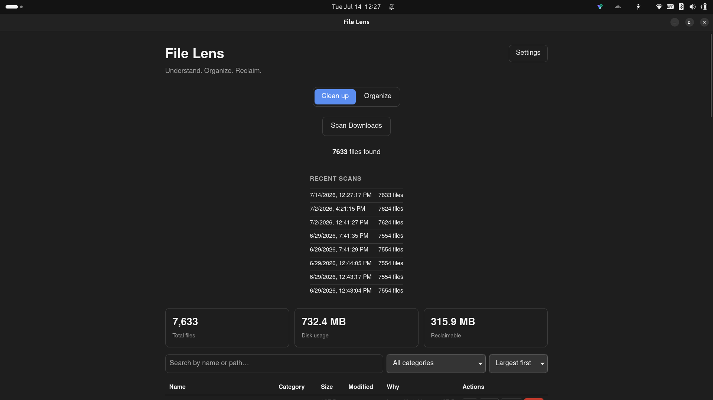
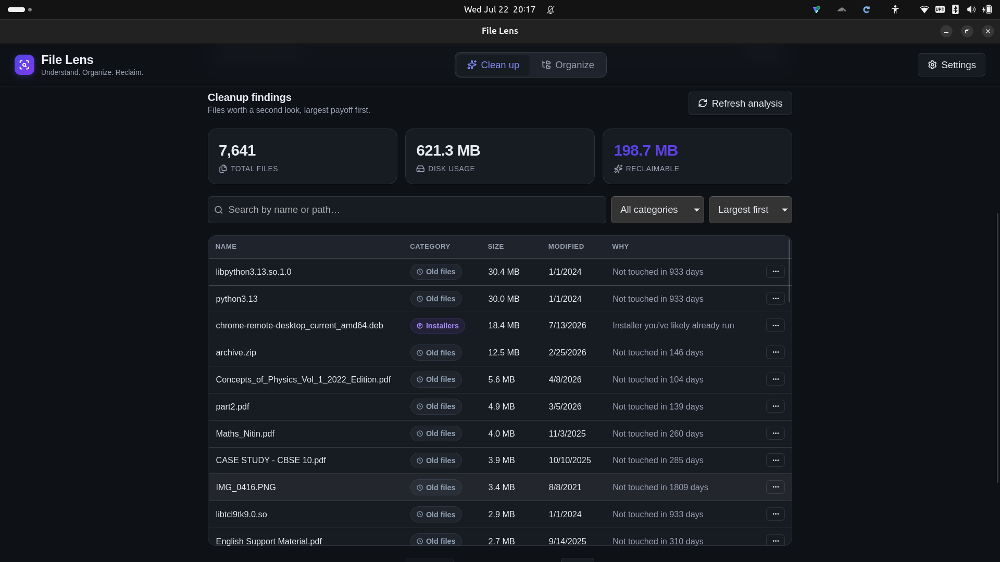
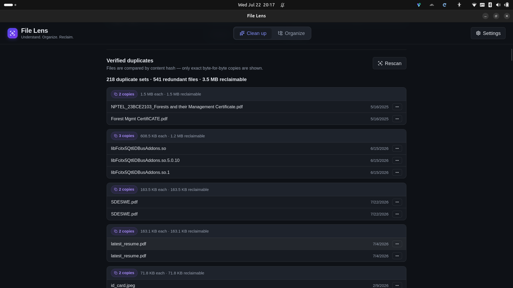
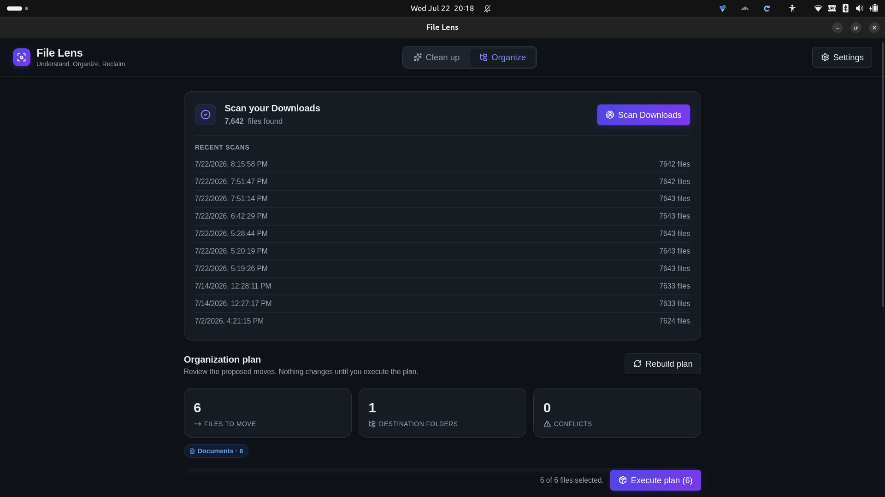
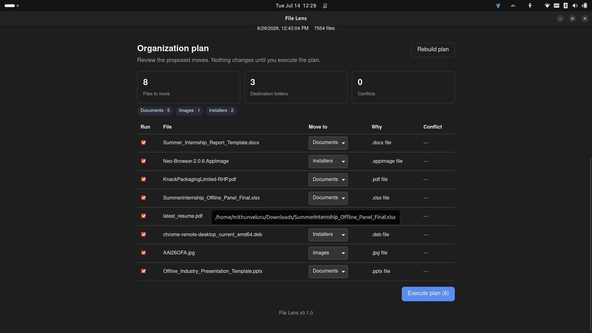
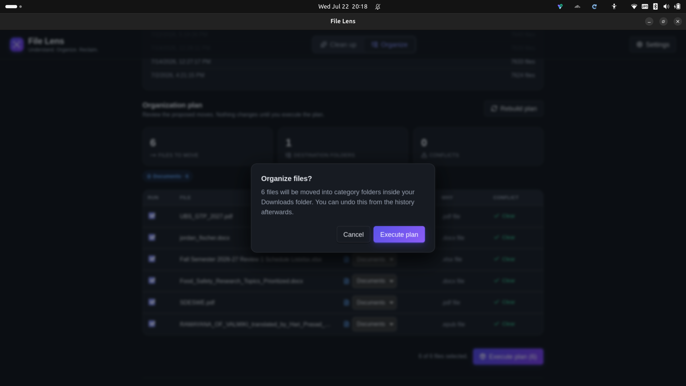

# File Lens

> Understand. Organize. Reclaim.

A desktop application for making sense of a cluttered Downloads folder. File Lens
scans a folder, explains what is taking up space and why, and offers reviewable
ways to organize or clean it up. Every change is previewed and requires explicit
confirmation. Nothing on disk is modified silently.



---

## Table of Contents

- [Project Overview](#project-overview)
- [Key Architecture and System Design](#key-architecture-and-system-design)
- [Core Modules and Workflow](#core-modules-and-workflow)
- [Deduplication and Performance Strategy](#deduplication-and-performance-strategy)
- [Interface](#interface)
- [Screenshots](#screenshots)
- [Development and Building](#development-and-building)
- [Safety and Security Boundary](#safety-and-security-boundary)
- [Limitations](#limitations)
- [Contributing](#contributing)
- [License](#license)

---

## Project Overview

Downloads folders accumulate installers that have already been run, half-finished
downloads, large archives, and many copies of the same file. The usual options
are to ignore it or sort it by hand, which is slow and easy to get wrong.

File Lens is a cross-platform desktop app built with Tauri: a Rust backend that
owns all filesystem, database, and analysis work, and a React frontend that
renders and dispatches intent. It reads a single folder — the OS Downloads
folder by default — and turns it into totals, per-file findings that always
state *why* a file was flagged, and reviewable plans for changing anything.

Three constraints shaped the design:

- **Transparency.** Every recommendation carries a plain-language reason. Every
  figure is derived from the actual scan, not estimated.
- **Control.** Proposed changes are reviewed and edited before they run.
  Organizing and cleanup are opt-in, per file.
- **Reversibility.** Deletion means "move to the OS Recycle Bin." Organization
  is preview-first and every executed session can be undone.

File Lens never permanently deletes a file. The most destructive action
available, and only on command, is a move to the Recycle Bin.

---

## Key Architecture and System Design

The frontend is sandboxed and never touches the filesystem. All privileged work
lives in Rust, which gives one place to enforce safety invariants and a
mockable, testable boundary between the two halves.

### System architecture

```
+---------------------------------------------------------------------------+
|  FRONTEND -- React 19 + TypeScript 5, running in the system WebView        |
|                                                                           |
|   features/     scan | analysis | dashboard | cleanup |                   |
|                 duplicates | organization | settings                      |
|   components/   Modal | RowActions | Tip | Chip | Spinner                 |
|   shared/ui/    domain value -> colour tone + icon mapping                |
|   styles/       design tokens, tone palette, base element styles          |
|                                                                           |
|   No filesystem access. No global store; state lives in per-feature hooks. |
+---------------------------------------------------------------------------+
                |                                          ^
                |  src/shared/ipc/commands.ts              |  typed results
                |  the only module that calls invoke()     |  (serde -> JSON)
                v                                          |
+===========================================================================+
||                          TAURI IPC BOUNDARY                             ||
||                                                                         ||
||  One TypeScript function per #[tauri::command], so the whole surface    ||
||  is discoverable in one file. Every argument that names a path is       ||
||  re-validated on the Rust side; the frontend is not trusted.            ||
+===========================================================================+
                |                                          ^
                v                                          |
+---------------------------------------------------------------------------+
|  BACKEND -- Rust (stable), owns every side effect                         |
|                                                                           |
|   +-------------+  +-------------+  +-------------+  +-----------------+  |
|   | filesystem  |  |  scanning   |  |  analysis   |  |     dedup       |  |
|   | one path -> |  | walk a tree |  | rule engine |  | size -> sample  |  |
|   | FileEntry   |  | cancellable |  | read-only   |  | -> BLAKE3       |  |
|   +-------------+  +-------------+  +-------------+  +-----------------+  |
|                                                                           |
|   +-------------+  +---------------------------+  +-----------------+     |
|   |  cleanup    |  |      organization         |  |    settings     |     |
|   | trash to    |  | classify -> plan ->       |  | thresholds,     |     |
|   | Recycle Bin |  | resolve -> execute -> undo|  | root resolution |     |
|   +-------------+  +---------------------------+  +-----------------+     |
+---------------------------------------------------------------------------+
                |                                          ^
                v                                          |
+---------------------------------------------------------------------------+
|  PERSISTENCE -- SQLite via rusqlite (bundled), WAL journal                 |
|  file_lens.db in the per-user app-data directory, opened once at startup   |
|  into a Mutex<Connection> held in Tauri state.                            |
|                                                                           |
|   scans | files | settings | ignored_paths |                              |
|   organization_sessions | organization_moves | hash_cache                 |
+---------------------------------------------------------------------------+
```

The `bundled` feature compiles SQLite into the binary, so there is no system
database dependency and no configuration step. WAL mode keeps reads from
blocking behind the write that follows a scan.

### Boundary rules

- The frontend reaches the backend only through `src/shared/ipc/commands.ts`.
  No feature calls Tauri's `invoke` directly.
- Every Rust `#[tauri::command]` has exactly one matching TypeScript function.
- Types crossing the boundary live in `src/shared/types`. A Rust struct
  serialized to the frontend has a matching TypeScript interface there.
- `settings::commands::active_root` is the single root resolver. Every command
  that reads or writes user files goes through it, so scanning, organizing, and
  trashing can never disagree about which folder is in scope.

### Request lifecycle

The app separates deciding what to do from doing it. A scan produces an
inventory; analysis turns that inventory into findings; any change is proposed
as a plan the user edits before it touches the filesystem.

```
Scan -> Analyze -> Findings -> Preview -> Approve -> Execute -> History -> Undo
```

---

## Core Modules and Workflow

### Backend (`src-tauri/src/`)

| Module | Responsibility |
| ------ | -------------- |
| `filesystem` | Reads one path plus its metadata into a typed `FileEntry`. No directory walking. |
| `scanning` | Recursively walks a folder into a `ScanOutcome`; owns progress emission and the cancel flag. |
| `database` | SQLite persistence: schema, inventory upsert, scan history, settings, organization history, hash cache. |
| `analysis` | Read-only rule engine that flags files and computes summary totals. |
| `dedup` | Verified duplicate detection: size grouping, sampled fingerprint, cache lookup, BLAKE3 hash. |
| `cleanup` | User actions: trash, reveal, ignore/unignore, file details. |
| `organization` | Classification, plan generation, conflict resolution, execution, and undo. |
| `settings` | Loads and saves configuration; applies thresholds and ignore rules to scans and analysis. |

Pure logic is kept apart from the code that performs side effects.
`scanning::scan` takes a cancel flag and a progress callback and is deliberately
Tauri-free, so the walk is unit-tested without a running app; `scanning::commands`
wires it to IPC. `organization::execution` is the only module in its package that
touches the disk.

### Scanning

The walk is synchronous and blocking, so it is dispatched with
`tauri::async_runtime::spawn_blocking` and awaited from the command. The window
stays responsive because the walk never runs on the async runtime's threads.

Cancellation is an `AtomicBool` shared between the command and the walk, checked
once per directory entry. Setting it makes the walk return what it has collected
so far with `cancelled: true`. A cancelled scan is partial, so it never prunes
the inventory; only a complete scan deletes rows for files it did not see.

Two guards apply:

- Symbolic links are never followed, so a link out of the folder cannot pull an
  unrelated tree into the inventory or create a cycle.
- The walk stops at 200,000 files and reports `limit_exceeded`. A Downloads
  folder does not hold that many; hitting the ceiling almost always means the
  wrong root was resolved, so the scan is refused rather than persisted.

Unreadable entries are logged, counted, and skipped. A single permission error
never aborts a scan.

Progress events are throttled to every 100 files. Emitting per file would flood
the IPC bridge on a large folder and cost more than the walk itself.

### Analysis

`analysis::analyze` is read-only. It takes the inventory plus thresholds and
returns `Finding`s, each carrying a human-readable reason. It never opens a file
or modifies anything.

Rules are plain functions of type `fn(&AnalysisInput) -> Vec<Finding>`, collected
in a `const RULES` slice. Adding a rule means writing the function and appending
it to the array — no traits, no registration. The current rules flag large files,
old files, installers, and temporary or partial downloads.

Summary totals are computed once in the backend so there is a single tested
source of truth. Reclaimable space counts a file flagged by several rules only
once.

Because the engine never reads file bytes, it cannot detect duplicates. That is
the `dedup` module's job, and it verifies by content rather than by metadata.

### Organization

Classification maps an extension, and failing that a MIME type, onto one of
eight destination folders: Documents, Images, Videos, Audio, Archives,
Installers, Code, Other. The tables live in `classifier.rs`, so adding a category
is a single-file change.

Planning is read-only. The backend proposes a complete plan; the frontend edits
it client-side (skip a file, change its category, choose a conflict strategy)
and nothing moves until the plan is executed. Conflict strategies are Keep both,
Rename, Replace, and Skip, defaulting to keeping both rather than overwriting.

Execution applies moves one at a time. A failure on one file is recorded and the
rest continue. Each move is `fs::rename` where possible, falling back to copy
then remove when the rename crosses a filesystem boundary.

Every executed session is recorded in two tables:

```
organization_sessions (id, created_ms, root, move_count, undone)
        |
        | 1..N   ON DELETE CASCADE
        v
organization_moves    (id, session_id, source, destination)
```

Storing the source and destination of each move is enough to reverse it. Undo
replays the pairs backwards, one file at a time, and refuses to restore a file
whose original location has since been reoccupied. It is a recorded move log
reversed file by file, not a database transaction: individual moves can fail
independently and are reported, which is the honest behaviour for filesystem
work that another process may have interfered with.

---

## Deduplication and Performance Strategy

Identity is decided by content, never by name, extension, or size. The cost of
proving that is a full read of every candidate file, so the pipeline exists to
make sure very few files reach that stage.

Each tier removes candidates before the next, more expensive one runs.

```
  INVENTORY  (every file from the scan)
      |
      |  Tier 1 -- GROUP BY SIZE                       cost: metadata only
      |  Files with a unique byte size cannot have a byte-identical twin.
      |  Zero-byte files are dropped: trivially identical, free no space.
      v
  size-collision groups (>= 2 members)
      |
      |  Tier 2 -- SAMPLED FINGERPRINT                 cost: <= 192 KB per file
      |  BLAKE3 over three 64 KB windows -- head, middle, tail -- plus the
      |  file size. Identical files always agree here, so any disagreement
      |  proves difference and skips the full read. Distinct files may still
      |  collide; this is a filter, not a verdict.
      v
  fingerprint-collision groups (>= 2 members)
      |
      |  Tier 3 -- VERIFY
      |
      |     +-- CACHE LOOKUP FIRST ------------------------------------+
      |     |  SELECT hash FROM hash_cache WHERE path = ?              |
      |     |  Reused only if size AND modified_ms AND algo still      |
      |     |  match. Any edit changes at least one, forcing a rehash. |
      |     +--------+----------------------------------+-------------+
      |              |                                  |
      |          HIT | (no file I/O)              MISS  | full read
      |              |                                  v
      |              |                    +-------------------------------+
      |              |                    |  BLAKE3 over the whole file,  |
      |              |                    |  streamed in 128 KB chunks.   |
      |              |                    |  Constant memory regardless   |
      |              |                    |  of file size.                |
      |              |                    +---------------+---------------+
      |              |                                    |
      |              +------------------+-----------------+
      |                                 v
      |                    new hashes buffered, then written
      |                    in ONE transaction after the pool
      |                    drains, so workers never wait on the DB
      v
  GROUP BY full hash, keep groups of >= 2
      |
      v
  REPORT  sorted by reclaimable bytes, descending
          (groups, redundant_files, reclaimable_bytes, files_hashed,
           cache_hits, errors, cancelled)
```

### Cost of a re-scan

The cache is keyed by path and validated against size, modified time, and hash
algorithm. When a file is untouched between runs, tier 3 costs one indexed
`SELECT` instead of reading the file, and `files_hashed` in the report drops
while `cache_hits` rises.

This is worth stating precisely rather than as a headline number. A re-scan is
still linear in the number of files: the directory walk runs again, and tier 2
re-reads up to 192 KB per surviving candidate because fingerprints are not
cached. What becomes constant is the *per-file verification* work for unchanged
files — the part that dominates on large media, where a full read is measured in
hundreds of megabytes and the cache lookup is measured in bytes.

Two tests pin this behaviour: `unchanged_files_reuse_cached_hashes_on_second_run`
asserts the second run hashes nothing, and `editing_a_file_invalidates_its_cached_hash`
asserts that a changed size and mtime force a rehash.

### Concurrency

Tiers 2 and 3 run on a bounded worker pool built on `std::thread::scope`:
`min(available_parallelism(), 8)` threads drain a shared queue behind a mutex.
The cap exists because both stages are I/O-bound; past a point more threads
produce more seek contention rather than more throughput.

Result order is not preserved, which is fine because every stage regroups by key
afterwards. The cancel flag is checked before each item is taken, so a cancelled
run stops within one file's work per thread and reports partial results rather
than an error.

Memory stays flat across the pipeline. The fingerprint holds one 64 KB buffer per
worker, the full hash holds one 128 KB buffer per worker, and neither reads a
whole file into memory. A 4 GB video costs the same resident bytes as a 4 KB text
file.

### Frontend filtering

The dashboard's search, category filter, sort, and pagination are a pure
function, `applyView(findings, options)`, memoized on the report and controls.
For a Downloads folder's scale — hundreds to thousands of files — client-side
filtering is simpler and fast enough; server-side pagination would add a round
trip per keystroke for no measurable gain.

---

## Interface

The frontend is plain CSS with custom properties. There is no CSS-in-JS and no
utility-class framework, so the design tokens stay readable in one file.

- `src/styles/global.css` holds every token — surfaces, text, lines, intent
  colours, radius, shadow, and motion scales — defined for light and dark.
  Feature stylesheets handle layout only.
- Nine named tones are declared as `[data-tone]` selectors, each carrying a tint
  RGB and a readable text stop that flips in dark mode. `shared/ui/tones.tsx`
  maps every finding category and destination folder to a tone and an icon, so a
  category's colour is declared once and applies to its table chip, summary chip,
  and plan row together.
- Dialogs, dropdown menus, and tooltips are built on Radix primitives, which
  supply focus trapping, scroll locking, Escape handling, keyboard navigation,
  and ARIA wiring.
- Transient results are toasts and carry their own actions, so Undo sits on the
  feedback for the action that caused it. States that must persist — a failed
  analysis, a failed duplicate run — stay as inline banners.
- Motion is limited to what CSS cannot express: exit animations for removed
  rows, the sliding workflow indicator, and the view transition.
  `prefers-reduced-motion` is honoured in both the CSS and the motion config.

---

## Screenshots

**Cleanup findings.** Every finding carries a colour-coded category and a
plain-language reason. Row actions collapse into a single menu.



**Verified duplicates.** Grouped by content hash, with the reclaimable total per
group.



**Organize.** The plan summary counts what will move, where it will go, and how
many naming conflicts need a decision.



**Organization plan.** An editable table of proposed moves. Change a
destination, skip a file, or resolve a conflict; the execute bar follows down the
page and the session lands in the history below, ready to undo.



**Confirmation.** Nothing touches the filesystem without an explicit yes.



---

## Development and Building

### Stack

| Technology | Role | Why |
| ---------- | ---- | --- |
| [Tauri 2](https://tauri.app) | Desktop shell | Native windows with a Rust backend and a small binary; keeps the UI sandboxed from the filesystem. |
| Rust (stable, edition 2021) | Backend | Memory safety and strong typing for the code that touches user files. |
| React 19 + TypeScript 5 | Frontend | Typed, component-based UI. |
| [Vite 7](https://vitejs.dev) | Build tooling | Fast dev server and bundling; also the basis for testing. |
| [Radix UI](https://www.radix-ui.com) | Accessible primitives | Dialog, dropdown, and tooltip behaviour — focus management and ARIA done correctly — styled entirely by this project's CSS. |
| [Lucide](https://lucide.dev) | Icons | Tree-shakeable; only imported icons are bundled. |
| [Framer Motion](https://motion.dev) | Animation | Exit and shared-layout transitions that CSS cannot express. |
| [Sonner](https://sonner.emilkowal.ski) | Toasts | Themeable notifications that carry their own actions. |
| SQLite via [rusqlite](https://github.com/rusqlite/rusqlite) (bundled) | Storage | Embedded, zero-configuration persistence; the bundled build needs no system SQLite. |
| [BLAKE3](https://github.com/BLAKE3-team/BLAKE3) | Hashing | Fast content hashing for duplicate verification. |
| [walkdir](https://github.com/BurntSushi/walkdir) | Directory traversal | Iterator-based walking with symlink control. |
| [trash](https://github.com/Byron/trash-rs) | Deletion | Cross-platform Recycle Bin integration instead of unlinking. |
| [Biome](https://biomejs.dev) | Lint and format | One fast tool replacing ESLint and Prettier. |
| [Vitest](https://vitest.dev) | Frontend tests | Vite-native runner for the pure frontend logic. |

State management uses React's built-in hooks and composition. There is no
external state library.

### Prerequisites

All platforms need:

- [Node.js](https://nodejs.org) 22.13 or newer
- [pnpm](https://pnpm.io) 11 or newer (the pinned `packageManager` field requires it)
- [Rust](https://rustup.rs), stable toolchain

Plus the platform's own toolchain:

| Platform | Requirement |
| -------- | ----------- |
| Windows | Microsoft C++ Build Tools (the "Desktop development with C++" workload). WebView2 ships with Windows 10 1803+ and Windows 11; older systems need the Evergreen runtime. |
| macOS | Xcode Command Line Tools: `xcode-select --install`. WebKit is part of the OS. |
| Linux | `webkit2gtk-4.1`, `libsoup-3.0`, GTK 3, and a C toolchain. |

On Debian and Ubuntu the Linux set is:

```bash
sudo apt update
sudo apt install libwebkit2gtk-4.1-dev build-essential curl wget file \
  libxdo-dev libssl-dev librsvg2-dev
```

Package names differ across distributions. The
[Tauri prerequisites guide](https://tauri.app/start/prerequisites/) is
authoritative for Fedora, Arch, openSUSE, and the rest.

### Installation

```bash
git clone https://github.com/mithunveluru/FileLens.git
cd FileLens
pnpm install
```

`pnpm install` also registers the pre-commit hook, which runs lint and
type-check.

### Running

```bash
pnpm tauri dev
```

The first run compiles the Rust backend and takes a few minutes. Later runs are
incremental. The frontend hot-reloads; changing Rust triggers a rebuild and
restart.

### Building

```bash
pnpm tauri build
```

This produces native installers: `.msi` and `.exe` on Windows, `.dmg` and `.app`
on macOS, `.deb` and `.AppImage` on Linux. Installing creates the platform's
standard application entry using the File Lens name and icon. Launching at login
is opt-in from Settings, via `tauri-plugin-autostart`.

The frontend can be built or previewed without the desktop shell:

```bash
pnpm build      # type-check and bundle the frontend
pnpm preview    # serve the production bundle
```

### Checks

| Command | Purpose |
| ------- | ------- |
| `pnpm lint` | Lint and format check (Biome) |
| `pnpm lint:fix` | Apply safe lint and format fixes |
| `pnpm typecheck` | Type-check without emitting |
| `pnpm test` | Frontend unit tests (Vitest) |

Backend checks run from `src-tauri/`:

```bash
cargo fmt --check
cargo clippy --all-targets -- -D warnings
cargo test
```

All of these run on every push and pull request via
[GitHub Actions](.github/workflows/ci.yml).

<details>
<summary>Troubleshooting</summary>

- **`pnpm tauri dev` fails to build on Linux.** Install the system dependencies
  listed under [Prerequisites](#prerequisites).
- **No application window appears.** The app opens a native window, so run it in
  a desktop session rather than over a plain SSH shell.
- **The dev window renders choppily on Linux/Wayland.** Disable the WebKitGTK
  DMA-BUF renderer for the run:
  `WEBKIT_DISABLE_DMABUF_RENDERER=1 pnpm tauri dev`.
- **`pnpm` reports ignored build scripts.** Build scripts are allow-listed in
  `pnpm-workspace.yaml`; run `pnpm install` again after pulling changes.
- **Rust build runs out of disk space.** `src-tauri/target` grows large;
  `cargo clean` reclaims it.
- **Need more detail in the logs.** Set `FILE_LENS_LOG` to `trace`, `debug`,
  `info`, `warn`, or `error` before launching to raise the backend log level.
  `VITE_LOG_LEVEL` sets the frontend minimum.

</details>

### Project structure

```
file-lens/
├── src/                      # React + TypeScript frontend
│   ├── features/             # scan, analysis, dashboard, cleanup,
│   │                         #   duplicates, organization, settings
│   ├── components/           # Modal, RowActions, Tip, Chip, Spinner
│   ├── shared/               # types, IPC command layer, formatting,
│   │                         #   logging, ui/ (tone and icon mapping)
│   └── styles/               # design tokens and the tone palette
├── src-tauri/                # Rust backend
│   └── src/                  # filesystem, scanning, database, analysis,
│                             #   dedup, cleanup, organization, settings
├── docs/                     # architecture and feature documentation
└── package.json
```

Further reading: [docs/ARCHITECTURE.md](docs/ARCHITECTURE.md),
[docs/DUPLICATE_DETECTION.md](docs/DUPLICATE_DETECTION.md), and
[docs/SMART_ORGANIZATION.md](docs/SMART_ORGANIZATION.md).

---

## Safety and Security Boundary

The filesystem is the sensitive boundary, and the frontend is treated as
untrusted input to it.

**Path containment.** Every path arriving over IPC is re-validated in Rust
before use. `is_safe_descendant` rejects any path containing a `..` component,
requires it to start with the resolved root, and then canonicalizes the deepest
existing ancestor and re-checks containment. The canonicalization step is what
catches a symlink pointing outside the folder, which a lexical prefix check
would accept. Both the source and the destination of every move are checked, and
undo applies the same test in reverse.

**No permanent deletion.** Trash uses the `trash` crate to move a file to the OS
Recycle Bin, where it remains recoverable. The backend refuses to trash anything
outside the configured folder and drops the file from the inventory afterwards.

**Confirmation before side effects.** Trashing requires an in-app confirmation
dialog. Organization runs only after an explicit plan approval, and the plan is
fully editable up to that point.

**Fail-safe defaults.** Naming conflicts default to keeping both files rather
than overwriting. Undo never overwrites a file that has reappeared at the
original location. A cancelled scan is treated as partial and never prunes the
inventory.

**Graceful degradation.** Permission errors, missing files, and locked files are
recorded and skipped. One failure does not abort a batch. A hash-cache write
failure costs a future rehash and nothing else. If the database is unusable at
startup it is recreated, or failing that opened in memory, so the app always
starts.

**Concurrency guards.** One scan and one duplicate run at a time, enforced by an
atomic flag; a second request is rejected rather than queued, so two runs cannot
fight over the shared cancel flag.

**Data locality.** Everything stays on the machine. There is no network client,
no telemetry, and no account. The database lives in the per-user app-data
directory.

These are practical safeguards, not formal guarantees. File Lens has not had a
third-party security audit.

---

## Limitations

Known gaps, stated plainly:

- Hidden-file detection keys off dotfile names, so Windows hidden-file
  attributes are not read.
- Fingerprints are not cached, so tier 2 re-reads sampled windows on every run.
- Undo is per-file and best-effort rather than atomic across a session; a
  partially reversed session is reported honestly rather than rolled back.
- Very large organization batches report no incremental progress.
- There is no system-tray or minimize-to-tray support; adding it would introduce
  another Linux runtime dependency.

---

## Contributing

Contributions are welcome. Before opening a pull request:

1. Read [docs/ARCHITECTURE.md](docs/ARCHITECTURE.md) and respect the module
   boundaries — the frontend talks to the backend only through the command
   layer.
2. Keep changes focused, with small, single-purpose functions and clear names.
3. Run the full check suite (`pnpm lint`, `pnpm typecheck`, `pnpm test`, and the
   `cargo` checks). The pre-commit hook covers lint and type-check.
4. Add tests for non-trivial logic, especially filesystem behaviour,
   classification, planning, and undo.
5. Write commit messages in the imperative mood, for example
   "Harden organization path validation".

See [CONTRIBUTING.md](CONTRIBUTING.md) for the full guidelines.

---

## License

Released under the [MIT License](LICENSE).

Built with [Tauri](https://tauri.app), [React](https://react.dev), and
[Rust](https://www.rust-lang.org).
