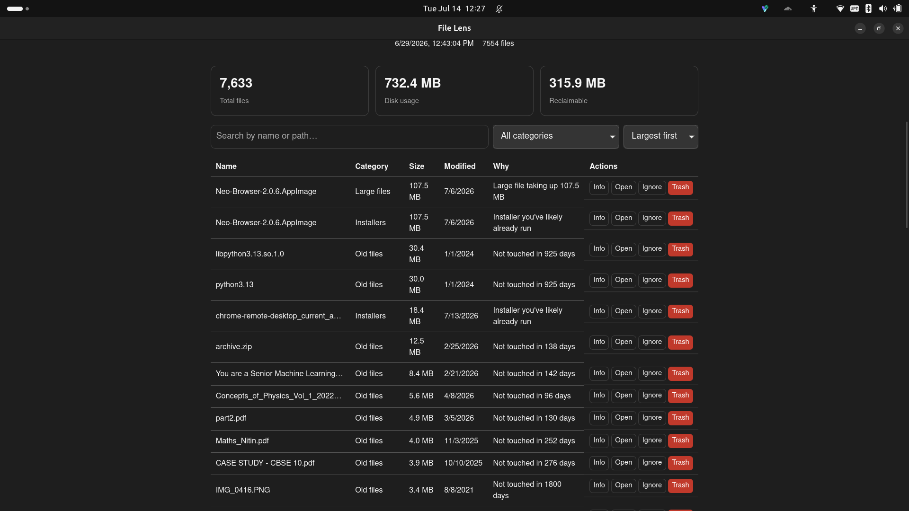

# File Lens

> Understand. Organize. Reclaim.

A desktop application for making sense of a cluttered Downloads folder. File Lens
scans your Downloads, explains what is taking up space and why, and offers safe,
reviewable ways to organize or clean it up. Every change is previewed and
requires explicit confirmation; nothing on disk is modified silently.


> Note: screenshots are placeholders. The images referenced throughout this
> document live under `docs/images/` and will be added in a future release.

---

## Overview

File Lens is a cross-platform desktop app built with [Tauri](https://tauri.app)
(a Rust backend and a React frontend). It reads the contents of a single folder
— your Downloads folder by default — and turns it into something you can reason
about: totals, reclaimable space, and per-file recommendations that always state
*why* a file was flagged.

It is meant for anyone whose Downloads folder has become a dumping ground:
developers, designers, and general users who want to clean up or reorganize
without manually sifting through hundreds of files, and without risking
accidental data loss.

File Lens does not delete files permanently. The most destructive action it can
take, and only on your command, is moving a file to the operating system's
Recycle Bin, from which it can be restored.

---

## Why File Lens?

Downloads folders accumulate installers you have already run, half-finished
downloads, large archives you forgot about, and many copies of the same file.
The usual options are to either ignore the mess or clean it up by hand, which is
slow and error-prone.

File Lens addresses this with three ideas:

- **Transparency.** Every recommendation includes a plain-language reason, and
  every figure (disk usage, reclaimable space) is derived from the actual scan.
- **Control.** You review and edit any proposed change before it runs. Organizing
  and cleanup are always opt-in, per file.
- **Safety.** Deletion means "move to the Recycle Bin." Organization is preview
  first and fully reversible. File paths are validated before any move.

---

## Key Features

**Scanning**
- Recursive scan of the Downloads folder with live progress and cancellation.
- Symbolic links are not followed; unreadable files are logged and skipped rather
  than aborting the scan.
- Results are persisted to a local database, so reopening the app does not require
  a rescan.

**Analysis**
- A read-only rule engine flags large files, old files, installers, temporary or
  partial downloads, and likely duplicates.
- Each finding carries a human-readable reason.
- The dashboard summarizes total files, total disk usage, and estimated
  reclaimable space (counting each file once and keeping one copy per duplicate
  group).

**Cleanup**
- Move files to the system Recycle Bin (with confirmation), ignore a
  recommendation (with undo), reveal a file in the system file manager, and view
  full file details.

**Smart Organization**
- Classify loose files into category folders (Documents, Images, Videos, Audio,
  Archives, Installers, Code, Other).
- A planning-first workflow: File Lens proposes a complete plan you can review and
  edit (skip a file, change its target category, resolve a naming conflict) and
  nothing moves until you execute it.
- Every executed session is recorded and can be undone.

**Desktop experience**
- On launch, the previously scanned results are shown immediately from the local
  database while a fresh scan runs in the background; the dashboard refreshes
  when it completes. Scanning is asynchronous and never blocks the window.

**Settings**
- Configure the Downloads folder, age and large-file thresholds, ignored folders
  and extensions, and theme (system, light, or dark).
- Startup preferences: scan automatically on open (on by default), remember the
  last scanned location, and launch File Lens at login (OS-level autostart).
- All settings are persisted.

> Duplicate detection currently uses a metadata heuristic (files that share an
> exact, non-zero size) rather than content hashing. See
> [Roadmap](#roadmap).

---

## Screenshots

| View | Preview |
| ---- | ------- |
| Dashboard |  |
| File scanner |  |
| Organization preview |  |
| Folder organization preview |  |
| Cleanup suggestions |  |
| Duplicate detection |  |
| Search |  |
| History |  |
| File details |  |
| Settings |  |
| Dark mode |  |
| Light mode |  |

---

## How It Works

The application separates *deciding what to do* from *doing it*. A scan produces
an inventory, analysis turns that inventory into insights, and any change is
proposed as a reviewable plan before it touches the filesystem.

```
Scan  ->  Analyze  ->  Insights  ->  Preview  ->  Approve  ->  Execute  ->  History  ->  Undo
```

At a high level, the frontend renders and dispatches intent while the Rust
backend owns all filesystem, database, and analysis work:

```
+------------------------------+        invoke()        +------------------------------+
|   React + TypeScript (UI)    | ---------------------> |     Rust backend (logic)     |
|   rendering, user intent     | <--------------------- |  fs - scan - analyze - move   |
+------------------------------+      typed results     +------------------------------+
                                                                     |
                                                              +--------------+
                                                              |   SQLite     |
                                                              +--------------+
```


The frontend never accesses the filesystem directly. It communicates with the
backend only through a typed set of commands, which keeps privileged operations
and safety checks in one place.

---

## Architecture

The backend is organized into focused modules, each with a single
responsibility. Pure logic (scanning, classification, planning, conflict
resolution) is kept separate from the code that performs side effects, so it can
be unit-tested without a running app or a real filesystem.

| Module | Responsibility |
| ------ | -------------- |
| `filesystem` | Reads a single file into typed metadata. |
| `scanning` | Walks a folder into an inventory; owns scan progress and cancellation. |
| `database` | SQLite persistence: inventory, scan history, settings, organization history. |
| `analysis` | Read-only rule engine that flags files and computes summary totals. |
| `cleanup` | User actions: trash, reveal, ignore/unignore, file details. |
| `organization` | Classification, plan generation, conflict resolution, execution, and undo. |
| `settings` | Loads and saves user configuration and applies it to scans and analysis. |

The frontend is feature-first: each feature (`scan`, `analysis`, `dashboard`,
`cleanup`, `organization`, `settings`) owns its UI and hooks, with shared
primitives and the command layer kept separate.

For a deeper explanation, see [docs/ARCHITECTURE.md](docs/ARCHITECTURE.md) and
[docs/SMART_ORGANIZATION.md](docs/SMART_ORGANIZATION.md).

---

## Technology Stack

| Technology | Role | Why |
| ---------- | ---- | --- |
| [Tauri 2](https://tauri.app) | Desktop shell | Native windows with a Rust backend and a small footprint; keeps the UI sandboxed from the filesystem. |
| Rust | Backend logic | Memory safety and strong typing for the code that touches user files. |
| React 19 + TypeScript | Frontend | A typed, component-based UI with a large ecosystem. |
| [Vite](https://vitejs.dev) | Build tooling | Fast dev server and bundling, and the basis for testing. |
| SQLite (via `rusqlite`, bundled) | Storage | Embedded, zero-configuration persistence with no external service; the bundled build needs no system SQLite. |
| [Biome](https://biomejs.dev) | Lint + format | A single fast tool for both, replacing ESLint and Prettier. |
| [Vitest](https://vitest.dev) | Frontend tests | Vite-native test runner for the pure frontend logic. |

State management uses React's built-in hooks and composition; there is no
external state library.

---

## Getting Started

### Prerequisites

- [Node.js](https://nodejs.org) 20 or newer and [pnpm](https://pnpm.io) 9 or newer
- [Rust](https://rustup.rs) (stable toolchain)
- Tauri's platform dependencies. See the
  [Tauri prerequisites guide](https://tauri.app/start/prerequisites/). On Linux
  this includes `webkit2gtk-4.1`, `libsoup-3.0`, and GTK 3.

### Installation

```bash
git clone <repository-url>
cd file-lens
pnpm install
```

`pnpm install` also registers the pre-commit hook.

### Development

Run the full desktop app with hot reload:

```bash
pnpm tauri dev
```

The first run compiles the Rust backend and may take a few minutes; later runs
are incremental.

### Building and Packaging

Produce an optimized, distributable build for your platform:

```bash
pnpm tauri build
```

This generates native installers (`.msi`/`.exe` on Windows, `.dmg`/`.app` on
macOS, `.deb`/`.AppImage` on Linux). Installing creates the platform's standard
application entry — a Start Menu entry on Windows and an application-menu entry
on Linux/macOS — using the File Lens name and icon. Users can also opt in to
launching File Lens at login from Settings.

The frontend alone can be built or previewed without the desktop shell:

```bash
pnpm build      # type-check and bundle the frontend
pnpm preview    # serve the production frontend bundle
```

### Quality Checks

| Command | Purpose |
| ------- | ------- |
| `pnpm lint` | Lint and format check (Biome) |
| `pnpm lint:fix` | Apply safe lint and format fixes |
| `pnpm typecheck` | Type-check without emitting |
| `pnpm test` | Run frontend unit tests (Vitest) |

Backend checks run from `src-tauri/`:

```bash
cargo fmt --check
cargo clippy --all-targets -- -D warnings
cargo test
```

<details>
<summary>Troubleshooting</summary>

- **`pnpm tauri dev` fails to build on Linux.** Install the Tauri system
  dependencies listed under [Prerequisites](#prerequisites).
- **No application window appears.** The app opens a native window, so run it in a
  desktop session rather than over a plain SSH shell.
- **`pnpm` reports ignored build scripts.** Build scripts are allow-listed in
  `pnpm-workspace.yaml`; run `pnpm install` again after pulling changes.
- **Rust build runs out of disk space.** The `src-tauri/target` directory can grow
  large; `cargo clean` reclaims it.

</details>

---

## Project Structure

```
file-lens/
├── src/                      # React + TypeScript frontend
│   ├── features/             # Feature modules: scan, analysis, dashboard,
│   │                         #   cleanup, organization, settings
│   ├── components/           # Shared UI primitives
│   ├── shared/               # Types, IPC command layer, formatting, logging
│   └── styles/               # Global styles and theme tokens
├── src-tauri/                # Rust backend
│   └── src/                  # filesystem, scanning, database, analysis,
│                             #   cleanup, organization, settings
├── docs/                     # Architecture and feature documentation
└── package.json
```

---

## Design Principles

These principles are reflected in the current codebase:

- **Separation of concerns.** Pure decision logic is kept apart from the code that
  performs filesystem and database side effects.
- **Single responsibility.** Each module and component does one thing.
- **Safe file operations.** Deletion moves files to the Recycle Bin; organization
  is preview-first and reversible.
- **Explicit user control.** Destructive actions require confirmation and are
  applied per file.
- **Strong typing.** TypeScript on the frontend and Rust on the backend, with a
  typed command boundary between them.
- **Modular, feature-first design.** Code is grouped by feature, not by technical
  layer.

---

## Security

File Lens treats the filesystem as the sensitive boundary it is.

- **No silent changes.** Moving files to the Recycle Bin requires explicit
  confirmation, and organization runs only after you approve a plan.
- **Path validation.** Trash and move operations are restricted to the configured
  folder. The organization engine rejects any source or destination that falls
  outside the root or contains a parent-directory (`..`) component, which closes
  directory-traversal attempts across the command boundary.
- **Fail-safe defaults.** Naming conflicts default to keeping both files rather
  than overwriting. Undo never overwrites a file that has reappeared at the
  original location.
- **Graceful failures.** Permission errors, missing files, and locked files are
  recorded and skipped; a single failure does not abort a batch operation.

These are practical safeguards, not formal guarantees. File Lens has not
undergone a third-party security audit.

---

## Roadmap

Realistic, not-yet-implemented enhancements being considered:

- Content-hash duplicate detection for higher accuracy than the current
  size-based heuristic.
- Windows hidden-file detection via file attributes (hidden detection currently
  keys off dotfile names).
- An in-app About section beyond the footer version line.
- Progress reporting for very large organization batches.
- System-tray support with minimize-to-tray (adds a Linux runtime dependency).
- A continuous-integration workflow running the full lint, type-check, and test
  suite.

---

## Contributing

Contributions are welcome. Before opening a pull request:

1. Read [docs/ARCHITECTURE.md](docs/ARCHITECTURE.md) and respect the module
   boundaries — the frontend talks to the backend only through the command layer.
2. Keep changes focused, with small, single-purpose functions and expressive
   names.
3. Run the full check suite (`pnpm lint`, `pnpm typecheck`, `pnpm test`, and the
   `cargo` checks). The pre-commit hook runs lint and type-check automatically.
4. Add tests for non-trivial logic, especially filesystem behaviour,
   classification, planning, and undo.
5. Write clear, descriptive commit messages in the imperative mood (for example,
   "Harden organization path validation").

See [CONTRIBUTING.md](CONTRIBUTING.md) for the full guidelines.

---

## License

File Lens is released under the [MIT License](LICENSE).

---

## Acknowledgements

Built with [Tauri](https://tauri.app), [React](https://react.dev), and
[Rust](https://www.rust-lang.org).
